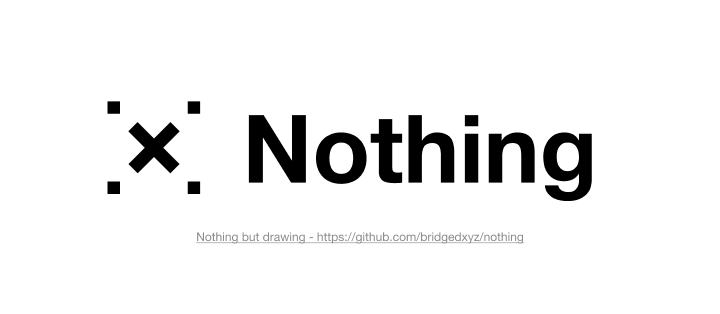

# nothing

nothing but drawing. everything drawable engine.

## Graphics engine

Engine for people eager to create, draw something on the canvas.

## Presentation engine

Engine for people eager to share, impress the world.

## Sheets engine

Engine for people eager to organize, make the knowledebase.

## Docs engine

Engine for people to make things real.

## All in one, performance fully optimized.

All in one, brand new experience you will have. don't imagine, try it now.

## References

- https://skia.org/
- https://api.skia.org/
- https://skia.org/docs/user/modules/canvaskit/
- https://groups.google.com/g/skia-discuss
- https://dbdiagram.io/
- https://draw.io/
- https://miro.com/
- http://figma.com/
- https://docs.microsoft.com/en-us/xamarin/xamarin-forms/user-interface/graphics/skiasharp/
- https://github.com/mono/SkiaSharp
- https://docs.microsoft.com/en-us/dotnet/api/skiasharp
- https://konvajs.org/
- https://github.com/rowsncolumns/grid/tree/master/packages/grid
