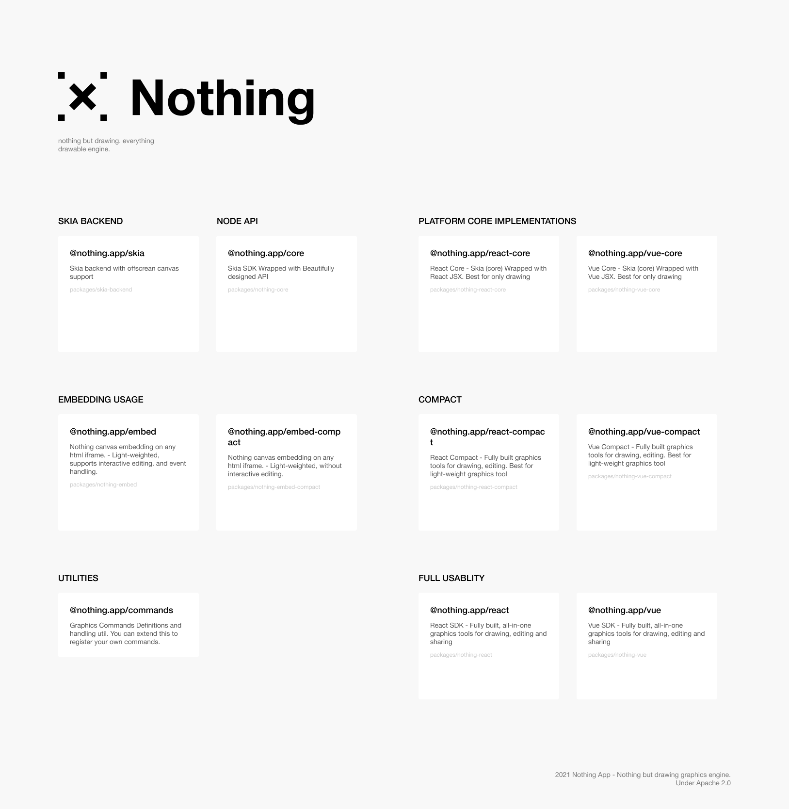

# nothing

nothing but drawing. everything drawable engine.

## Graphics engine

Engine for people eager to create, draw something on the canvas.

## Presentation engine

Engine for people eager to share, impress the world.

## Sheets engine

Engine for people eager to organize, make the knowledebase.

## Docs engine

Engine for people to make things real.

## All in one, performance fully optimized.

All in one, brand new experience you will have. don't imagine, try it now.

## Structure - Packages & Modules

- [@nothing.app/skia](./packages/skia-backend) - Skia Backend
  - Skia backend with offscrean canvas support
- [@nothing.app/core](packages/nothing-core) - Skia Node Api
  - Skia SDK Wrapped with Beautifully designed API
- [@nothing.app/react-core](./packages/nothing-react-core) - React Core
  - React Core - Skia (core) Wrapped with React JSX. Best for only drawing
- [@nothing.app/react-compact](packages/nothing-react-compact) - React Compact
  - React Compact - Fully built graphics tools for drawing, editing. Best for light-weight graphics tool
- [@nothing.app/react](packages/nothing-react) - Nothing React
  - React SDK - Fully built, all-in-one graphics tools for drawing, editing and sharing
- [@nothing.app/vue-core](./packages/nothing-vue-core) - Vue Core
  - Vue Core - Skia (core) Wrapped with Vue JSX. Best for only drawing
- [@nothing.app/vue-compact](./packages/nothing-vue-compact) - Vue Compact
  - Vue Compact - Fully built graphics tools for drawing, editing. Best for light-weight graphics tool
- [@nothing.app/vue](packages/nothing-vue) - Nothing Vue
  - Vue SDK - Fully built, all-in-one graphics tools for drawing, editing and sharing
- [@nothing.app/commands](./packages/nothing-util-commands) - Command util
  - Graphics Commands Definitions and handling util. You can extend this to register your own commands.

## Philosophy

- Ready to use - Comparing to figma or sketch, there must not be a limitations in usablity. this software will be enterprise standard opensourced UI Graphics tool.
- Opensourced - Yep it's here on github.
- Modularity - all features and functionality are provided in modular shape
- Performant - based on skia engine (which chrome is based on), Nothing is performant and highly optimized, givving all native performance. cannot be compared to html5 canvas based applications.
- Reusability - all components are built to be used on other projects. you can build your entirely new projects from it.
- Extansibility - from extending a theme, to extending a 
- Composable - Components are composable, same as code components. Now you can finally design as the code is.
- Largely built-in features - such as live collaboration support
- Fully customizable - from self hosting to extending functionality.

## References

- https://skia.org/
- https://api.skia.org/
- https://skia.org/docs/user/modules/canvaskit/
- https://groups.google.com/g/skia-discuss
- https://dbdiagram.io/
- https://draw.io/
- https://miro.com/
- http://figma.com/
- https://docs.microsoft.com/en-us/xamarin/xamarin-forms/user-interface/graphics/skiasharp/
- https://github.com/mono/SkiaSharp
- https://docs.microsoft.com/en-us/dotnet/api/skiasharp
- https://konvajs.org/
- https://github.com/rowsncolumns/grid/tree/master/packages/grid
