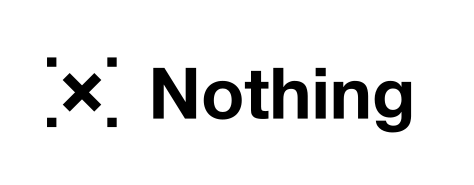

  

# n0 ("nothing")

Nothing but drawing. An engine for everything drawable.

`n0` (pronounced "nothing") is a 2D graphics engine.

## Status

The graphics engine lives here. It migrated from the
[Grida repository](https://github.com/gridaco/grida) with its full history
(2025→) carried over; Grida remains the service/editor monorepo and consumes
the engine only through published artifacts.

Two engines live side by side while the topology converges: the migrated
production engine (`crates/grida`, shipping as `@grida/canvas-wasm`) and
the v2 `n0` engine family (`crates/n0`), promoted from the
`model-v2-anchor` research branch. The v2 model program is tracked in
[gridaco/nothing#9](https://github.com/gridaco/nothing/issues/9).

## Workspace

- [`crates/grida`](./crates/grida) — the canvas/rendering engine core
- [`crates/grida_editor`](./crates/grida_editor) — the editor core (document, history, commands)
- [`crates/grida-canvas-wasm`](./crates/grida-canvas-wasm) — WASM bindings (`@grida/canvas-wasm`)
- [`crates/math2`](./crates/math2) · [`crates/csscascade`](./crates/csscascade) · [`crates/fonts`](./crates/fonts) — foundations
- [`crates/grida_dev`](./crates/grida_dev) · [`crates/grida_wpt`](./crates/grida_wpt) — dev tools, benchmarks, reftests
- [`crates/n0`](./crates/n0) — the `n0` engine (v2): resolve → drawlist → paint
- [`crates/n0-model`](./crates/n0-model) · [`crates/n0_dev`](./crates/n0_dev) — the skia-free `anchor` model · the v2 dev shell
- [`model-v2/`](./model-v2) — the frozen v2 workbench archive (decision record)
- [`format/`](./format) — the FlatBuffers schema (source of truth)
- [`docs/wg/`](./docs/wg) — the engine's normative working-group specs

The repository is a Rust-first Cargo workspace.
