# Web-first capability status

<!-- GENERATED FILE - do not edit. Regenerate:
UPDATE_CAPABILITY_STATUS=1 cargo test -p websem --test capability_status -->

A generated, freshness-gated view of the two corpora that track the
SVG engine of record's capability: what renders (the Chromium-baked
cells) and what departs by name (the refusal register). Every refusal
line is the compiler's actual departure, recompiled by the gate
(`crates/websem/tests/capability_status.rs`), so this file cannot
drift from behavior. The prose statement of record is
[crates/n0_cli/README.md](../../crates/n0_cli/README.md); the rung
history is the
[D-N register](../../docs/wg/consolidation/svg-engine-of-record.md);
the per-fixture rationale is
[unsupported/README.md](./unsupported/README.md).

Not a conformance claim: no score is computed or implied (FLIP is
unratified), and the corpus enumerates constructs, not the SVG
surface.

## Chromium-baked cells (609)

Each renders byte-exact against its committed Chromium oracle
(seven curved cells and four gradient ramps carry a declared, bounded
tolerance — see [README.md](./README.md)). Every thumbnail below
*is* that committed oracle, which byte-exactness makes this
engine's own render too; hover for the cell's name, click through
to its fixture source. No new image is committed for this view.

<a href="./svg-clip-path-chain-opacity.svg" title="svg-clip-path-chain-opacity (standalone-svg)">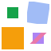</a>

<a href="./svg-context-paint-radial-obb-host-box.svg" title="svg-context-paint-radial-obb-host-box (standalone-svg)">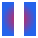</a>

<a href="./svg-filter-blend-mode-atlas-opaque.svg" title="svg-filter-blend-mode-atlas-opaque (standalone-svg)">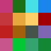</a>
<a href="./svg-filter-blend-mode-atlas-translucent.svg" title="svg-filter-blend-mode-atlas-translucent (standalone-svg)">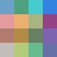</a>

<a href="./svg-filter-color-matrix-hue-grammar.svg" title="svg-filter-color-matrix-hue-grammar (standalone-svg)">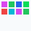</a>

<a href="./svg-filter-color-matrix-luminance-values.svg" title="svg-filter-color-matrix-luminance-values (standalone-svg)">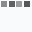</a>
<a href="./svg-filter-color-matrix-matrix-count.svg" title="svg-filter-color-matrix-matrix-count (standalone-svg)">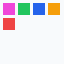</a>

<a href="./svg-filter-color-matrix-number-underflow.svg" title="svg-filter-color-matrix-number-underflow (standalone-svg)">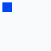</a>

<a href="./svg-filter-color-matrix-saturate-grammar.svg" title="svg-filter-color-matrix-saturate-grammar (standalone-svg)">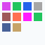</a>

<a href="./svg-filter-color-matrix-type-grammar.svg" title="svg-filter-color-matrix-type-grammar (standalone-svg)">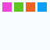</a>
<a href="./svg-filter-color-srgb.svg" title="svg-filter-color-srgb (standalone-svg)">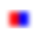</a>
<a href="./svg-filter-component-transfer-alpha.svg" title="svg-filter-component-transfer-alpha (standalone-svg)">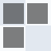</a>

<a href="./svg-filter-component-transfer-clamp.svg" title="svg-filter-component-transfer-clamp (standalone-svg)">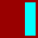</a>

<a href="./svg-filter-component-transfer-offset-order.svg" title="svg-filter-component-transfer-offset-order (standalone-svg)">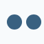</a>

<a href="./svg-filter-component-transfer-primitive-units.svg" title="svg-filter-component-transfer-primitive-units (standalone-svg)">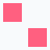</a>

<a href="./svg-filter-component-transfer-shadow-order.svg" title="svg-filter-component-transfer-shadow-order (standalone-svg)">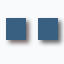</a>

<a href="./svg-filter-composite-arithmetic-mix.svg" title="svg-filter-composite-arithmetic-mix (standalone-svg)">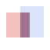</a>

<a href="./svg-filter-composite-atop.svg" title="svg-filter-composite-atop (standalone-svg)">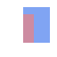</a>

<a href="./svg-filter-composite-number-exponent.svg" title="svg-filter-composite-number-exponent (standalone-svg)">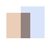</a>

<a href="./svg-filter-drop-shadow-anisotropic.svg" title="svg-filter-drop-shadow-anisotropic (standalone-svg)">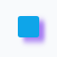</a>

<a href="./svg-filter-drop-shadow-color-srgb.svg" title="svg-filter-drop-shadow-color-srgb (standalone-svg)">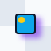</a>
<a href="./svg-filter-drop-shadow-currentcolor.svg" title="svg-filter-drop-shadow-currentcolor (standalone-svg)">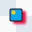</a>

<a href="./svg-filter-drop-shadow-opacity-percentage-precision.svg" title="svg-filter-drop-shadow-opacity-percentage-precision (standalone-svg)">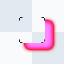</a>
<a href="./svg-filter-drop-shadow-primitive-region.svg" title="svg-filter-drop-shadow-primitive-region (standalone-svg)">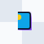</a>
<a href="./svg-filter-drop-shadow-primitive-units-object.svg" title="svg-filter-drop-shadow-primitive-units-object (standalone-svg)">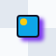</a>

<a href="./svg-filter-drop-shadow-result-chain.svg" title="svg-filter-drop-shadow-result-chain (standalone-svg)">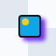</a>

<a href="./svg-filter-drop-shadow-target-opacity.svg" title="svg-filter-drop-shadow-target-opacity (standalone-svg)">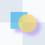</a>

<a href="./svg-filter-drop-shadow-viewbox-scale.svg" title="svg-filter-drop-shadow-viewbox-scale (standalone-svg)">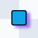</a>

<a href="./svg-filter-morphology-axis-fractional.svg" title="svg-filter-morphology-axis-fractional (standalone-svg)">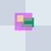</a>

<a href="./svg-filter-morphology-chain-two.svg" title="svg-filter-morphology-chain-two (standalone-svg)">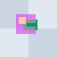</a>

<a href="./svg-filter-morphology-channel-linear.svg" title="svg-filter-morphology-channel-linear (standalone-svg)">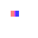</a>

<a href="./svg-filter-morphology-operator-grammar.svg" title="svg-filter-morphology-operator-grammar (standalone-svg)">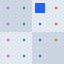</a>

<a href="./svg-filter-morphology-quarter-turn.svg" title="svg-filter-morphology-quarter-turn (standalone-svg)">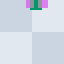</a>
<a href="./svg-filter-morphology-radius-invalid.svg" title="svg-filter-morphology-radius-invalid (standalone-svg)">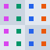</a>
<a href="./svg-filter-morphology-radius-large-finite.svg" title="svg-filter-morphology-radius-large-finite (standalone-svg)">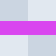</a>
<a href="./svg-filter-morphology-radius-number-list.svg" title="svg-filter-morphology-radius-number-list (standalone-svg)">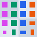</a>
<a href="./svg-filter-morphology-radius-rounding.svg" title="svg-filter-morphology-radius-rounding (standalone-svg)">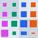</a>

<a href="./svg-filter-morphology-region-zero-crop.svg" title="svg-filter-morphology-region-zero-crop (standalone-svg)">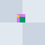</a>
<a href="./svg-filter-morphology-result-shadow.svg" title="svg-filter-morphology-result-shadow (standalone-svg)">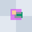</a>

<a href="./svg-filter-morphology-shadow-after.svg" title="svg-filter-morphology-shadow-after (standalone-svg)">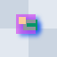</a>
<a href="./svg-filter-morphology-shadow-before.svg" title="svg-filter-morphology-shadow-before (standalone-svg)">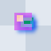</a>
<a href="./svg-filter-morphology-source-alpha.svg" title="svg-filter-morphology-source-alpha (standalone-svg)">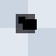</a>
<a href="./svg-filter-morphology-source-number-alias.svg" title="svg-filter-morphology-source-number-alias (standalone-svg)">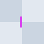</a>

<a href="./svg-filter-morphology-target-mask.svg" title="svg-filter-morphology-target-mask (standalone-svg)">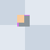</a>
<a href="./svg-filter-morphology-target-opacity.svg" title="svg-filter-morphology-target-opacity (standalone-svg)">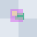</a>

<a href="./svg-filter-morphology-viewbox-half-step.svg" title="svg-filter-morphology-viewbox-half-step (standalone-svg)">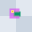</a>

<a href="./svg-filter-offset-input-region-default.svg" title="svg-filter-offset-input-region-default (standalone-svg)">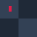</a>

<a href="./svg-filter-units-grammar.svg" title="svg-filter-units-grammar (standalone-svg)">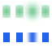</a>

<a href="./svg-gradient-css-transform.svg" title="svg-gradient-css-transform (standalone-svg)">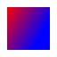</a>
<a href="./svg-gradient-currentcolor.svg" title="svg-gradient-currentcolor (standalone-svg)">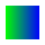</a>

## The refusal register (140)

What the slice refuses, by name, in the compiler's own words —
**both refuse** is a document-level contract; **declared** renders
the rest and names the hole. A rung that admits a construct moves
its row into the cells above.

| Fixture | Admission | The compiler's departure |
| --- | --- | --- |
| `svg-clip-path-animation` | declared | skipped svg/rect[2]: unsupported SVG clip-path: a <rect> contributor's authored geometry is overridden at document load: its authored state is overridden at document load by the unsupported animation at svg/clipPath[1]/rect[1]/animate[1]: <animate> must be a direct child of a materialized top-level <rect> |
| `svg-clip-path-basic-shape` | declared | skipped svg/rect[2]: unsupported SVG clip-path: a CSS basic-shape clip-path uses the independently listed basic-shape route |
| `svg-clip-path-cycle` | declared | skipped svg/rect[2]: unsupported SVG clip-path: url(#a) forms a cyclic clip-path chain, whose raster/path strategy is not admitted |
| `svg-clip-path-external` | declared | skipped svg/rect[2]: unsupported SVG clip-path: url(https://example.test/clip.svg#shape) is external; this compiler owns no resource I/O |
| `svg-clip-path-geometry-box` | declared | skipped svg/rect[2]: unsupported SVG clip-path: a CSS geometry-box clip-path needs the target's CSS/SVG box-world route |
| `svg-clip-path-raster-strategy` | declared | skipped svg/rect[2]: unsupported SVG clip-path: visible <text> inside <clipPath> uses Chromium's raster-mask strategy; skipped svg/rect[3]: unsupported SVG clip-path: a <rect> contributor with its own clip-path uses Chromium's raster-mask strategy; skipped svg/rect[4]: unsupported SVG clip-path: a <clipPath> has 43 visible path contributors; Chromium switches to its raster-mask strategy above 42 |
| `svg-clip-path-root` | **both refuse** | unsupported SVG clip-path: clip-path on the root <svg> uses the host CSS-layer coordinate route |
| `svg-clip-rule-css-property` | declared | declaration ignored at svg/style[1]: a stylesheet declares clip-rule, which this cascade does not represent; elements it matches render without it |
| `svg-clip-rule-raw-syntax` | declared | skipped svg/rect[2]: unsupported SVG clip-path: clip-rule presentation attribute contains a CSS comment; the direct attribute decoder does not tokenize comments; skipped svg/rect[3]: unsupported SVG clip-path: clip-rule presentation attribute contains a CSS escape; the direct attribute decoder does not tokenize escapes; skipped svg/rect[4]: unsupported SVG clip-path: clip-rule presentation attribute uses var(), whose substitution is not represented at this Stylo pin |
| `svg-context-paint-fallback-extension` | declared | skipped svg/rect[2]: unsupported fill value "a context paint carries Stylo's non-standard fallback extension; Chromium drops this declaration" |
| `svg-css-individual-rotate` | declared | skipped svg/rect[2]: unsupported computed style: style attribute on <rect> declares rotate, which this cascade does not represent |
| `svg-css-transform-3d` | declared | skipped svg/rect[2]: unsupported computed style: transform on <rect> uses translate3d(), which is outside the 2D affine function set this slice consumes |
| `svg-css-transform-box` | declared | skipped svg/rect[2]: unsupported computed style: style attribute on <rect> declares transform-box, which this cascade does not represent |
| `svg-css-transform-origin` | declared | skipped svg/rect[2]: unsupported computed style: style attribute on <rect> declares transform-origin, which this cascade does not represent |
| `svg-display-contents` | declared | skipped svg/g[1]: unsupported computed style: display: contents is not yet consumed |
| `svg-filter-blend-clip-precision` | declared | skipped svg/rect[2]: unsupported SVG filter: feBlend crosses the pinned-backend filtered clip-path precision boundary |
| `svg-filter-blend-transform-precision` | declared | skipped svg/rect[2]: unsupported SVG filter: feBlend's target mapping crosses the pinned-backend blend-filter transform precision boundary |
| `svg-filter-blur-sigma-precision` | declared | skipped svg/rect[2]: unsupported SVG filter: feGaussianBlur has an effective sigma in the pinned-backend small-kernel precision boundary |
| `svg-filter-color-css` | declared | skipped svg/rect[2]: unsupported SVG filter: CSS color-interpolation-filters in a filter resource is not represented by the pinned cascade; use of it is quarantined from the direct attribute decoder |
| `svg-filter-color-matrix-source-layer-precision` | declared | skipped svg/circle[1]: unsupported SVG filter: feColorMatrix's source image crosses the pinned-backend color-matrix source-layer precision boundary |
| `svg-filter-color-matrix-spatial-precision` | declared | skipped svg/circle[1]: unsupported SVG filter: a source-derived filter graph combines feColorMatrix with a spatial filter at the pinned-backend composed-operation precision boundary |
| `svg-filter-color-matrix-transform-precision` | declared | skipped svg/circle[1]: unsupported SVG filter: feColorMatrix's target mapping crosses the pinned-backend color-matrix transform precision boundary |
| `svg-filter-color-raw-syntax` | declared | skipped svg/rect[2]: unsupported SVG filter: color-interpolation-filters presentation attribute contains a CSS comment; the direct attribute decoder does not tokenize comments |
| `svg-filter-component-transfer-source-layer-precision` | declared | skipped svg/circle[1]: unsupported SVG filter: feComponentTransfer's source image crosses the pinned-backend table-filter paint-server precision boundary; skipped svg/circle[2]: unsupported SVG filter: feComponentTransfer's source image crosses the pinned-backend table-filter paint-server precision boundary; skipped svg/circle[3]: unsupported SVG filter: feComponentTransfer's source image crosses the pinned-backend table-filter paint-server precision boundary |
| `svg-filter-component-transfer-transform-precision` | declared | skipped svg/rect[2]: unsupported SVG filter: feComponentTransfer's target mapping crosses the pinned-backend table-filter transform precision boundary; skipped svg/rect[3]: unsupported SVG filter: feComponentTransfer's target mapping crosses the pinned-backend table-filter transform precision boundary |
| `svg-filter-css-functions` | declared | skipped svg/rect[2]: unsupported SVG filter: filter presentation attribute uses CSS filter functions, which are a separate unresolved operation grammar |
| `svg-filter-css-property` | declared | skipped svg/rect[2]: unsupported computed style: style attribute on <rect> declares filter, which this cascade does not represent |
| `svg-filter-drop-shadow-color-precision` | declared | skipped svg/rect[2]: unsupported SVG filter: feDropShadow with an interior-channel flood color in linearRGB crosses the pinned-backend native-shadow color-conversion precision boundary |
| `svg-filter-drop-shadow-range` | declared | skipped svg/rect[2]: unsupported SVG filter: feDropShadow parameters cross the admitted native-shadow range |
| `svg-filter-drop-shadow-source-layer-precision` | declared | skipped svg/rect[2]: unsupported SVG filter: feDropShadow's source subtree crosses the pinned-backend native-shadow source-layer precision boundary |
| `svg-filter-drop-shadow-transform-precision` | declared | skipped svg/g[1]: unsupported SVG filter: feDropShadow's target mapping crosses the pinned-backend native-shadow transform precision boundary |
| `svg-filter-effect-stack-precision` | declared | skipped svg/g[1]/rect[1]: unsupported SVG filter: a filtered target is enclosed by one element that combines clip-path with partial opacity at the pinned-backend effect-stack precision boundary |
| `svg-filter-external` | declared | skipped svg/rect[2]: unsupported SVG filter: url(https://example.test/filter.svg#f) is external; this compiler owns no resource I/O |
| `svg-filter-flood-color-syntax` | declared | skipped svg/rect[2]: unsupported SVG filter: feFlood flood-color is outside the admitted color slice: color space Hsl is not yet gated against Chromium |
| `svg-filter-flood-css-property` | declared | declaration ignored at svg/style[1]: a stylesheet declares flood-color, which this cascade does not represent; elements it matches render without it |
| `svg-filter-flood-inherit` | declared | skipped svg/rect[2]: unsupported SVG filter: feFlood flood-color uses inherit, which needs the unavailable cascaded flood-color longhand |
| `svg-filter-flood-opacity-calc` | declared | skipped svg/rect[2]: unsupported SVG filter: feFlood flood-opacity is a CSS function this build cannot evaluate without a computation context |
| `svg-filter-flood-var` | declared | skipped svg/rect[2]: unsupported SVG filter: feFlood flood-color resolves through var(), whose substitution is not represented at this Stylo pin |
| `svg-filter-href` | declared | skipped svg/rect[2]: unsupported SVG filter: <filter> href inheritance is not yet resolved |
| `svg-filter-list` | declared | skipped svg/rect[2]: unsupported SVG filter: filter presentation attribute uses multiple filter operations |
| `svg-filter-list-quoted` | declared | skipped svg/rect[2]: unsupported SVG filter: filter presentation attribute uses multiple filter operations |
| `svg-filter-morphology-filled-ellipse-precision` | declared | skipped svg/circle[1]: unsupported SVG filter: feMorphology's active source image crosses the retained filled-ellipse coverage boundary |
| `svg-filter-morphology-paint-server-precision` | declared | skipped svg/rect[2]: unsupported SVG filter: feMorphology's source image crosses the pinned-backend morphology paint-server precision boundary |
| `svg-filter-morphology-transform-precision` | declared | skipped svg/g[1]: unsupported SVG filter: feMorphology's target mapping crosses the pinned-backend morphology transform precision boundary |
| `svg-filter-offset-blur-precision` | declared | skipped svg/rect[2]: unsupported SVG filter: a filter graph combines feOffset with Gaussian blur, which crosses the pinned-backend composed-operation precision boundary |
| `svg-filter-offset-fractional-precision` | declared | skipped svg/rect[2]: unsupported SVG filter: feOffset uses a fractional displacement, which crosses the pinned-backend rasterization boundary |
| `svg-filter-offset-transform-precision` | declared | skipped svg/g[1]/rect[1]: unsupported SVG filter: feOffset's target mapping produces a fractional device-space displacement at the pinned-backend rasterization boundary |
| `svg-filter-primitive` | declared | skipped svg/rect[2]: unsupported SVG filter: filter graph contains unsupported primitive <feTurbulence> |
| `svg-filter-primitive-empty-region` | declared | skipped svg/rect[2]: unsupported SVG filter: a non-positive filter primitive region is not yet represented as a transparent graph result |
| `svg-filter-region-calc` | declared | skipped svg/rect[2]: unsupported SVG filter: filter region x uses calc(), whose computed length is not represented at this Stylo pin |
| `svg-filter-region-range` | declared | skipped svg/rect[2]: unsupported SVG filter: filter region width crosses the unimplemented Web used-length range |
| `svg-filter-region-unit` | declared | skipped svg/rect[2]: unsupported SVG filter: filter region x uses the em unit, whose basis is not admitted |
| `svg-filter-region-var` | declared | skipped svg/rect[2]: unsupported SVG filter: filter region x uses var(), whose computed length is not represented at this Stylo pin |
| `svg-filter-root` | **both refuse** | unsupported SVG filter: filter on the root <svg> uses the host CSS-layer coordinate route |
| `svg-filter-translucent-source-composition-precision` | declared | skipped svg/rect[2]: unsupported SVG filter: a source-derived multi-input filter graph crosses the pinned-backend translucent-source composition precision boundary |
| `svg-foreign-object` | declared | skipped svg/foreignObject[1]: unsupported element <foreignObject> |
| `svg-geometry-calc-values` | declared | skipped svg/circle[1]: attribute cx="calc(8px + 8px)" is not a number; skipped svg/circle[2]: attribute cy="calc(8px \* 4)" is not a number; skipped svg/circle[3]: attribute r="calc(4px + 4px)" is not a number |
| `svg-geometry-css-comments` | declared | skipped svg/circle[1]: attribute cx="/\*\*/16" is not a number; skipped svg/circle[2]: attribute cy="/\*\*/32/\*\*/" is not a number; skipped svg/circle[3]: attribute r="/\*\*/8/\*\*/" is not a number |
| `svg-geometry-css-properties` | declared | declaration ignored at svg/style[1]: a stylesheet declares cx, which this cascade does not represent; elements it matches render without it; skipped svg/circle[2]: unsupported computed style: style attribute on <circle> declares cy, which this cascade does not represent; skipped svg/circle[3]: unsupported computed style: style attribute on <circle> declares r, which this cascade does not represent |
| `svg-geometry-css-wide-keywords` | declared | skipped svg/circle[1]: attribute cx="initial" is not a number; skipped svg/circle[2]: attribute cy="unset" is not a number; skipped svg/circle[3]: attribute r="revert" is not a number; skipped svg/circle[4]: attribute cx="inherit" is not a number |
| `svg-geometry-numeric-precision-alias` | declared | skipped svg/circle[1]: unsupported SVG geometry: cx numeric precision alias loses Chromium used-value provenance; skipped svg/circle[2]: unsupported SVG geometry: cy numeric precision alias loses Chromium used-value provenance; skipped svg/circle[3]: unsupported SVG geometry: r numeric precision alias loses Chromium used-value provenance; skipped svg/circle[4]: unsupported SVG geometry: cx numeric precision alias loses Chromium used-value provenance; skipped svg/circle[5]: unsupported SVG geometry: cy numeric precision alias loses Chromium used-value provenance; skipped svg/circle[6]: unsupported SVG geometry: r numeric precision alias loses Chromium used-value provenance |
| `svg-geometry-percentage-overflow` | declared | skipped svg/circle[1]: unsupported SVG geometry: cx resolves outside the finite frame range; skipped svg/circle[2]: unsupported SVG geometry: cy resolves outside the finite frame range; skipped svg/circle[3]: unsupported SVG geometry: r resolves outside the finite frame range |
| `svg-geometry-unit-values` | declared | skipped svg/circle[1]: attribute cx="12pt" is not a number; skipped svg/circle[2]: attribute cy="16px" is not a number; skipped svg/circle[3]: attribute r="8px" is not a number |
| `svg-geometry-used-range` | declared | skipped svg/circle[1]: unsupported SVG geometry: cx exceeds the admitted Web used-value range; skipped svg/circle[2]: unsupported SVG geometry: cy exceeds the admitted Web used-value range; skipped svg/circle[3]: unsupported SVG geometry: r exceeds the admitted Web used-value range |
| `svg-geometry-var-values` | declared | skipped svg/g[1]/circle[1]: attribute cx="var(--cx)" is not a number; skipped svg/g[1]/circle[2]: attribute cy="var(--cy)" is not a number; skipped svg/g[1]/circle[3]: attribute r="var(--r)" is not a number |
| `svg-geometry-xywh-calc-values` | declared | skipped svg/rect[2]: attribute x="calc(8px + 8px)" is not a number; skipped svg/rect[3]: attribute y="calc(8px + 8px)" is not a number; skipped svg/rect[4]: attribute width="calc(8px \* 2)" is not a number; skipped svg/rect[5]: attribute height="calc(8px \* 2)" is not a number |
| `svg-geometry-xywh-css-comments` | declared | skipped svg/rect[2]: attribute x="/\*\*/16/\*\*/" is not a number; skipped svg/rect[3]: attribute y="/\*\*/16/\*\*/" is not a number; skipped svg/rect[4]: attribute width="/\*\*/16/\*\*/" is not a number; skipped svg/rect[5]: attribute height="/\*\*/16/\*\*/" is not a number |
| `svg-geometry-xywh-css-properties` | declared | declaration ignored at svg/style[1]: a stylesheet declares x, which this cascade does not represent; elements it matches render without it; skipped svg/rect[3]: unsupported computed style: style attribute on <rect> declares y, which this cascade does not represent; skipped svg/rect[4]: unsupported computed style: CSS width (LengthPercentage(NonNegative(Length(32.0 px)))) is not yet consumed; skipped svg/rect[5]: unsupported computed style: CSS height (LengthPercentage(NonNegative(Length(32.0 px)))) is not yet consumed |
| `svg-geometry-xywh-css-wide-keywords` | declared | skipped svg/rect[2]: attribute x="initial" is not a number; skipped svg/rect[3]: attribute y="unset" is not a number; skipped svg/rect[4]: attribute width="revert" is not a number; skipped svg/rect[5]: attribute height="inherit" is not a number; skipped svg/rect[6]: attribute x="revert-layer" is not a number |
| `svg-geometry-xywh-numeric-precision-alias` | declared | skipped svg/rect[2]: unsupported SVG geometry: x numeric precision alias loses Chromium used-value provenance; skipped svg/rect[3]: unsupported SVG geometry: y numeric precision alias loses Chromium used-value provenance; skipped svg/rect[4]: unsupported SVG geometry: width numeric precision alias loses Chromium used-value provenance; skipped svg/rect[5]: unsupported SVG geometry: height numeric precision alias loses Chromium used-value provenance; skipped svg/rect[6]: unsupported SVG geometry: x numeric precision alias loses Chromium used-value provenance; skipped svg/rect[7]: unsupported SVG geometry: y numeric precision alias loses Chromium used-value provenance; skipped svg/rect[8]: unsupported SVG geometry: width numeric precision alias loses Chromium used-value provenance; skipped svg/rect[9]: unsupported SVG geometry: height numeric precision alias loses Chromium used-value provenance |
| `svg-geometry-xywh-percentage-overflow` | declared | skipped svg/rect[2]: unsupported SVG geometry: x resolves outside the finite frame range; skipped svg/rect[3]: unsupported SVG geometry: y resolves outside the finite frame range; skipped svg/rect[4]: unsupported SVG geometry: width resolves outside the finite frame range; skipped svg/rect[5]: unsupported SVG geometry: height resolves outside the finite frame range |
| `svg-geometry-xywh-rect-auto` | declared | skipped svg/rect[2]: attribute width="auto" is not a number; skipped svg/rect[3]: attribute height="auto" is not a number |
| `svg-geometry-xywh-unit-values` | declared | skipped svg/rect[2]: attribute x="16px" is not a number; skipped svg/rect[3]: attribute y="16px" is not a number; skipped svg/rect[4]: attribute width="16px" is not a number; skipped svg/rect[5]: attribute height="16px" is not a number |
| `svg-geometry-xywh-used-range` | declared | skipped svg/rect[2]: unsupported SVG geometry: x exceeds the admitted Web used-value range; skipped svg/rect[3]: unsupported SVG geometry: x exceeds the admitted Web used-value range; skipped svg/rect[4]: unsupported SVG geometry: y exceeds the admitted Web used-value range; skipped svg/rect[5]: unsupported SVG geometry: y exceeds the admitted Web used-value range; skipped svg/rect[6]: unsupported SVG geometry: width exceeds the admitted Web used-value range; skipped svg/rect[7]: unsupported SVG geometry: height exceeds the admitted Web used-value range |
| `svg-geometry-xywh-var-values` | declared | skipped svg/g[1]/rect[1]: attribute x="var(--x)" is not a number; skipped svg/g[1]/rect[2]: attribute y="var(--y)" is not a number; skipped svg/g[1]/rect[3]: attribute width="var(--w)" is not a number; skipped svg/g[1]/rect[4]: attribute height="var(--h)" is not a number |
| `svg-gradient-degenerate-precision` | declared | skipped svg/rect[1]: unsupported fill value "url(#a): a degenerate paint server substitutes a colour this build cannot reproduce: the collapsed alpha is not exactly representable in eight bits, and Chromium dithers it"; skipped svg/rect[2]: unsupported fill value "url(#b): a degenerate paint server collapses two alpha stages, and their product is not exactly representable in eight bits"; skipped svg/rect[3]: unsupported fill value "url(#c): a degenerate paint server collapses before post-paint opacity, and the staged product is not exactly representable in eight bits"; skipped svg/rect[4]: unsupported fill value "url(#d): a degenerate paint server substitutes a colour this build cannot reproduce: the collapsed alpha is not exactly representable in eight bits, and Chromium dithers it"; skipped svg/rect[5]: unsupported fill value "url(#e): a degenerate paint server averages a ramp whose stop is not exactly representable in eight bits, and Chromium dithers the result" |
| `svg-gradient-focal` | declared | skipped svg/rect[1]: unsupported fill value "url(#g): the radial gradient has a focal point or focal radius, which the shared radial paint leaf cannot state (concentric radials only)" |
| `svg-gradient-linearrgb` | declared | skipped svg/rect[1]: unsupported fill value "url(#g): color-interpolation: linearRGB interpolates stops in linear-light sRGB, which this slice does not execute (sRGB interpolation only)" |
| `svg-gradient-stop-css` | declared | declaration ignored at svg/style[1]: a stylesheet declares stop-color, which this cascade does not represent; elements it matches render without it |
| `svg-gradient-stop-function` | declared | skipped svg/rect[1]: unsupported fill value "url(#g): a <stop> stop-opacity is a function this build cannot evaluate without a computation context" |
| `svg-gradient-stop-inherit` | declared | skipped svg/rect[1]: unsupported fill value "url(#g): a <stop> stop-color is inherit, which needs a cascaded longhand this build does not have" |
| `svg-gradient-stop-nonlegacy-color` | declared | skipped svg/rect[1]: unsupported fill value "url(#g): a gradient <stop> colour is a non-legacy sRGB colour, which changes how Chromium interpolates the whole ramp" |
| `svg-gradient-stop-style-attr` | declared | skipped svg/rect[1]: unsupported fill value "url(#g): a gradient <stop> declares stop-color in a style attribute, which this cascade does not represent" |
| `svg-gradient-stop-var` | declared | skipped svg/rect[1]: unsupported fill value "url(#g): a <stop> stop-opacity resolves through var(), an indirection this patrol cannot follow" |
| `svg-gradient-unit-basis` | declared | skipped svg/rect[1]: unsupported fill value "url(#g): gradient geometry x2=\"4em\" uses a unit whose basis this slice does not consume (numbers, px, and percentages only)" |
| `svg-image` | declared | skipped svg/image[1]: unsupported element <image> |
| `svg-mask-css-properties` | declared | skipped svg/rect[2]: unsupported computed style: style attribute on <rect> declares mask-image, which this cascade does not represent |
| `svg-mask-cycle` | declared | skipped svg/rect[2]: unsupported SVG mask: mask source cannot be compiled completely: unsupported SVG mask: mask source cannot be compiled completely: unsupported SVG mask: url(#a) forms a cyclic nested mask chain |
| `svg-mask-external` | declared | skipped svg/rect[2]: unsupported SVG mask: url(https://example.test/mask.svg#m) is external; this compiler owns no resource I/O; skipped svg/rect[3]: unsupported SVG mask: url(../mask.svg#m) is a relative external reference; this compiler owns no resource base or I/O |
| `svg-mask-full-shorthand` | declared | skipped svg/rect[2]: unsupported SVG mask: mask presentation attribute uses an unrepresented full shorthand or multiple mask layers |
| `svg-mask-region-calc` | declared | skipped svg/rect[2]: unsupported SVG mask: mask region x uses calc(), whose computed length is not represented at this Stylo pin |
| `svg-mask-region-unit` | declared | skipped svg/rect[2]: unsupported SVG mask: mask region x uses the em unit, whose basis is not admitted |
| `svg-mask-region-used-range` | declared | skipped svg/rect[2]: unsupported SVG mask: mask region x crosses the unimplemented Web used-length range; skipped svg/rect[3]: unsupported SVG mask: mask region x crosses the unimplemented Web used-length range |
| `svg-mask-region-var` | declared | skipped svg/rect[2]: unsupported SVG mask: mask region x uses var(), whose computed length is not represented at this Stylo pin |
| `svg-mask-resource-style-inheritance` | declared | skipped svg/rect[2]: unsupported SVG mask: inline style on <mask> declares shape-rendering, whose source-side cascade effect is not represented; skipped svg/rect[3]: unsupported SVG mask: inline style on <mask> declares color-interpolation, whose source-side cascade effect is not represented |
| `svg-mask-root` | **both refuse** | unsupported SVG mask: mask on the root <svg> uses the host CSS-layer coordinate route |
| `svg-mask-source-pattern` | declared | skipped svg/rect[2]: unsupported SVG mask: mask source cannot be compiled completely: unsupported element <pattern> |
| `svg-mask-transform-precision` | declared | skipped svg/rect[2]: unsupported SVG mask: mask region target transform leaves the measured translation/positive-downscale precision envelope |
| `svg-mask-type-css` | declared | skipped svg/rect[2]: unsupported SVG mask: CSS mask-type on <mask> is not represented by the pinned cascade; use of it is quarantined from the direct attribute decoder |
| `svg-mask-type-inherit` | declared | skipped svg/rect[2]: unsupported SVG mask: mask-type presentation attribute uses inherit, whose parent computed value is not represented at this Stylo pin |
| `svg-mask-type-var` | declared | skipped svg/rect[2]: unsupported SVG mask: mask-type presentation attribute uses var(), whose substitution is not represented at this Stylo pin |
| `svg-mask-var` | declared | skipped svg/rect[2]: unsupported SVG mask: mask presentation attribute uses var(), whose substitution is not represented at this Stylo pin |
| `svg-nested-svg` | declared | skipped svg/svg[1]: unsupported element <svg> |
| `svg-path-css-d-property` | declared | declaration ignored at svg/style[1]: a stylesheet declares d, which this cascade does not represent; elements it matches render without it |
| `svg-path-marker-end` | declared | skipped svg/path[1]: unsupported rendering attribute marker-end on <path> (not yet consumed) |
| `svg-pattern-paint-server` | declared | skipped svg/pattern[1]: unsupported element <pattern>; skipped svg/rect[2]: unsupported fill value "url(#p): url(#p) resolves to a <pattern> paint server, which the resolved frame cannot express" |
| `svg-points-odd-coordinate` | declared | skipped svg/polygon[1]: points on <polygon> is invalid at byte 17 (near "") |
| `svg-preserve-aspect-ratio-case-folded` | **both refuse** | preserveAspectRatio "xmidymid meet" is invalid |
| `svg-preserve-aspect-ratio-defer` | **both refuse** | preserveAspectRatio "defer xMidYMid meet" is invalid |
| `svg-preserve-aspect-ratio-invalid-align` | **both refuse** | preserveAspectRatio "xMidYMiddle meet" is invalid |
| `svg-smil-animate-transform` | declared | skipped svg/g[1]: its authored state is overridden at document load by the unsupported animation at svg/g[1]/animateTransform[1]: animation element <animateTransform> is outside the rect-x proving slice |
| `svg-smil-retarget-href` | **both refuse** | SVG animation at svg/rect[2]/set[1] is unsupported: animation element <set> is outside the rect-x proving slice; it carries href, so its target cannot be attributed to one element without id resolution; it is active at document load, so the authored state it overrides cannot render as the Base view |
| `svg-smil-set-load-active` | declared | skipped svg/rect[2]: its authored state is overridden at document load by the unsupported animation at svg/rect[2]/set[1]: animation element <set> is outside the rect-x proving slice |
| `svg-stroke-dasharray-escape` | declared | skipped svg/path[1]: unsupported stroke value "a stroke-dasharray on <path> carries a CSS escape this patrol cannot read" |
| `svg-stroke-dasharray-font-basis` | declared | skipped svg/path[1]: unsupported stroke value "a stroke-dasharray in em on <path> under an authored font-size carrying vw needs a basis this cascade does not have" |
| `svg-stroke-dasharray-sheet-unit` | declared | declaration ignored at svg/style[1]: a stylesheet declares a stroke-dasharray in ex, which needs a basis this cascade does not have; elements it matches render the wrong dash cycle |
| `svg-stroke-dasharray-var` | declared | skipped svg/path[1]: unsupported stroke value "a stroke-dasharray on <path> resolves through var(), an indirection this patrol cannot follow" |
| `svg-stroke-dashoffset-escape` | declared | skipped svg/path[1]: unsupported stroke value "a stroke-dashoffset on <path> carries a CSS escape this patrol cannot read" |
| `svg-stroke-dashoffset-font-basis` | declared | skipped svg/path[1]: unsupported stroke value "a stroke-dashoffset in em on <path> under an authored font-size carrying vw needs a basis this cascade does not have" |
| `svg-stroke-dashoffset-percentage-precision-alias` | declared | skipped svg/path[1]: unsupported stroke value "stroke-dashoffset percentage precision alias loses Chromium used-value provenance" |
| `svg-stroke-dashoffset-sheet-unit` | declared | declaration ignored at svg/style[1]: a stylesheet declares a stroke-dashoffset in ex, which needs a basis this cascade does not have; elements it matches render the wrong dash phase |
| `svg-stroke-dashoffset-var` | declared | skipped svg/path[1]: unsupported stroke value "a stroke-dashoffset on <path> resolves through var(), an indirection this patrol cannot follow" |
| `svg-stroke-paint-order` | declared | skipped svg/rect[1]: unsupported rendering attribute paint-order on <rect> (not yet consumed) |
| `svg-stroke-sheet-unit-width` | declared | declaration ignored at svg/style[1]: a stylesheet declares a stroke-width in ex, which needs a basis this cascade does not have; elements it matches render at the wrong width |
| `svg-stroke-vector-effect` | declared | skipped svg/g[1]/rect[1]: unsupported rendering attribute vector-effect on <rect> (not yet consumed) |
| `svg-stroke-width-calc-mixed` | declared | skipped svg/rect[1]: unsupported stroke value "a calc() stroke-width mixing lengths and percentages is not consumed" |
| `svg-stroke-width-font-basis` | declared | skipped svg/rect[1]: unsupported stroke value "a stroke-width in em on <rect> under an authored font-size carrying vw needs a basis this cascade does not have" |
| `svg-stroke-width-percentage-precision-alias` | declared | skipped svg/path[1]: unsupported stroke value "stroke-width percentage precision alias loses Chromium used-value provenance" |
| `svg-stroke-width-var` | declared | declaration ignored at svg/style[1]: a stylesheet declares a stroke-width through var(), an indirection this patrol cannot follow; elements it matches may render at the wrong width |
| `svg-switch` | declared | skipped svg/switch[1]: unsupported element <switch> |
| `svg-text-tspan` | declared | skipped svg/text[1]: unsupported element <tspan> |
| `svg-text-undeclared-font` | declared | skipped svg/text[1]: unsupported computed style: text resolution refused: font family "Undeclared" is not in the declared environment |
| `svg-use-authored-children` | declared | skipped svg/use[1]: unsupported <use>: it has authored element children, which Chromium replaces with the shadow content |
| `svg-use-external` | declared | skipped svg/use[1]: unsupported <use>: its reference is not a same-document fragment, and external resources are not resolved |
| `svg-use-stylesheet` | declared | skipped svg/use[1]: unsupported <use>: the document carries author CSS, and shadow-scoped selector matching is not yet consumed (selectors must match inside the cloned subtree alone — measured) |
| `svg-use-symbol` | declared | skipped svg/symbol[1]: unsupported element <symbol>; skipped svg/use[1]/symbol[1]: unsupported element <symbol> |
| `svg-viewbox-invalid-token` | **both refuse** | viewBox "0 0 invalid 64 64" is invalid |
| `svg-viewbox-repeated-comma` | **both refuse** | viewBox "0 0,,64 64" is invalid |
| `svg-viewbox-trailing-comma` | **both refuse** | viewBox "0 0 64 64," is invalid |
| `svg-width-percentage` | **both refuse** | unsupported SVG viewport sizing: percentage width="50%" on the root <svg> is not yet consumed |
